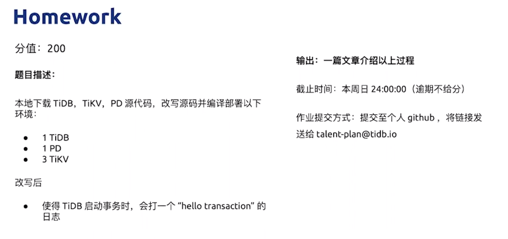
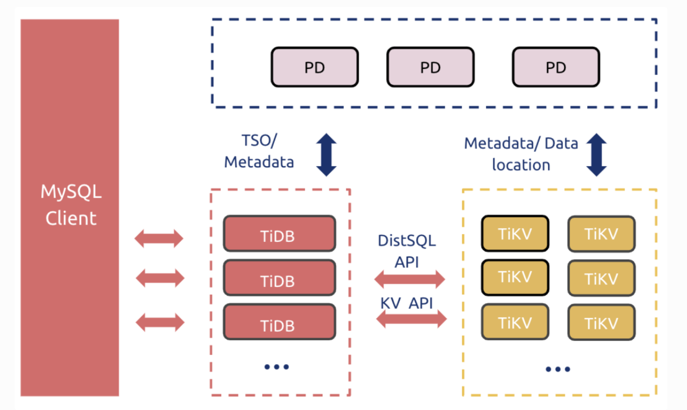
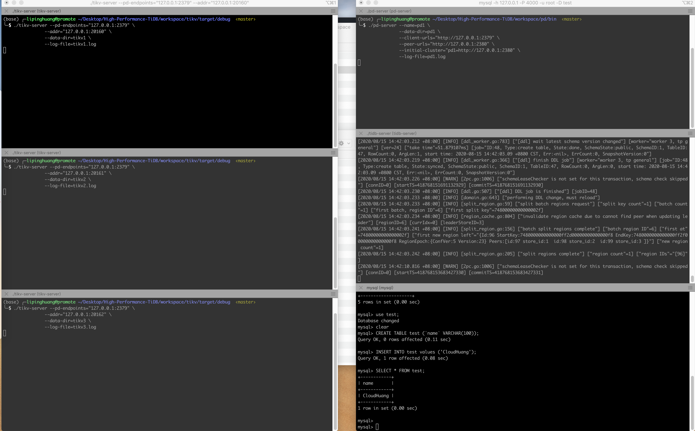
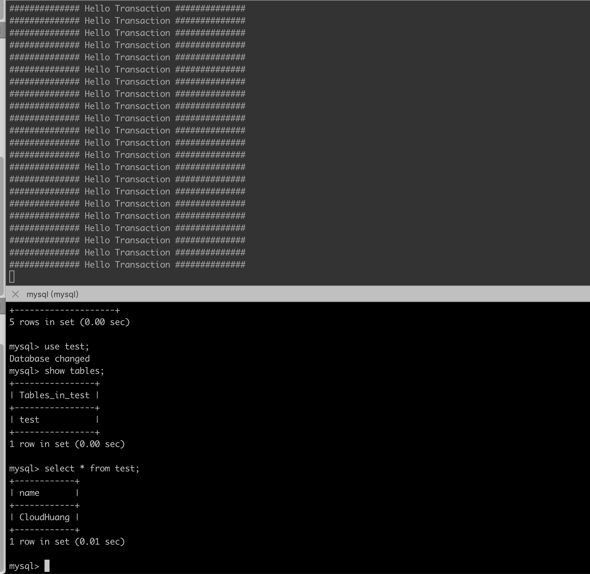

homework1
==============


# Introduction

## TiKV

主页: [https://tikv.org/](https://tikv.org/)

gIthub: [https://github.com/tikv/tikv](https://github.com/tikv/tikv)

TiKV 是一个基于Rust语言的，支持事务的分布式 Key-Value 数据库。

## TiDB

主页: [https://pingcap.com/](https://pingcap.com/)

github: [https://github.com/pingcap/tidb](https://github.com/pingcap/tidb)

TiDB 是一款定位于在线事务处理/在线分析处理（ HTAP: Hybrid Transactional/Analytical Processing）的融合型数据库产品，实现了一键水平伸缩，强一致性的多副本数据安全，分布式事务，实时 OLAP 等重要特性。同时兼容 MySQL 协议和生态，迁移便捷，运维成本极低。

## PD

github: [https://github.com/pingcap/pd](https://github.com/pingcap/pd)

PD(Placement Driver )是TiDB 里面全局中心总控节点，它负责整个集群的调度，负责全局 ID 的生成，以及全局时间戳 TSO 的生成等。PD 还保存着整个集群 TiKV 的元信息，负责给 client 提供路由功能。

作为中心总控节点，PD 通过集成 [etcd](https://github.com/coreos/etcd) ，自动的支持 auto failover，无需担心单点故障问题。同时，PD 也通过 etcd 的 raft，保证了数据的强一致性，不用担心数据丢失的问题。

## TiKV，PD，TiDB架构



该图展示了TiDB的架构，TiKV用于存储数据，PD作为总控，TiDB则为SQL引擎。

# 从源码构建TiKV，PD，TiDB

**GO version**

```
$ go version
go version go1.13.6 darwin/amd64
```

## 编译TiKV

由于TiKV是使用Rust语言编写的，所以从源码编译TiKV需要首先安装Rust的本地开发环境，这里只要使用到了[Cargo]([https://crates.io/](https://crates.io/))的包管理工具，所以首先是安装Cargo

```bash
$ curl https://sh.rustup.rs -sSf | sh
Rust is installed now. Great!
```

在安装的过程中会询问采用默认方式按照，还是定制化安装，或者是取消按照，直接选择default就可以了，当屏幕上打印出"Rust is installed now. Great!"信息，则表明按照成功了。然后需要将`cargo`加入到系统的PATH:

```bash
cat >> ~/.bashrc <<EOF
PATH=$HOME/.cargo/bin:$PATH
EOF
```

这样就可以使用`cargo`构建了。

### 开始构建

首先克隆TiKV的仓库，然后执行`make build`命令

```bash
git clone [https://github.com/tikv/tikv](https://github.com/tikv/tikv)
cd tikv
make build # debug版本
make release # release版本
```

整个过程TiKV需要从github更新依赖的仓库，耗时视网络情况。

编译后会在targets目录生成相应的编译版本。

```bash
/tikv-server -h                                                                                                                                          130 ↵
TiKV
Release Version:   4.1.0-alpha
Edition:           Community
Git Commit Hash:   ae7a6ecee6e3367da016df0293a9ffe9cc2b5705
Git Commit Branch: master
UTC Build Time:    2020-08-15 01:25:18
Rust Version:      rustc 1.46.0-nightly (16957bd4d 2020-06-30)
Enable Features:   jemalloc sse protobuf-codec
Profile:           debug

A distributed transactional key-value database powered by Rust and Raft

USAGE:
    tikv-server [FLAGS] [OPTIONS]

FLAGS:
        --config-check           Check config file validity and exit
    -h, --help                   Prints help information
        --print-sample-config    Print a sample config to stdout
    -V, --version                Prints version information

OPTIONS:
    -A, --addr <IP:PORT>                     Set the listening address
        --advertise-addr <IP:PORT>           Set the advertise listening address for client communication
        --advertise-status-addr <IP:PORT>    Set the advertise listening address for the client communication of status
                                             report service
        --capacity <CAPACITY>                Set the store capacity
    -C, --config <FILE>                      Set the configuration file
    -s, --data-dir <PATH>                    Set the directory used to store data
        --labels <KEY=VALUE>...              Sets server labels
    -f, --log-file <FILE>                    Sets log file
    -L, --log-level <LEVEL>                  Set the log level [possible values: trace, debug, info, warn, warning,
                                             error, critical]
        --metrics-addr <IP:PORT>             Sets Prometheus Pushgateway address
        --pd-endpoints <PD_URL>...           Sets PD endpoints
        --status-addr <IP:PORT>              Set the HTTP listening address for the status report service
```

### tikv-ctl

```bash
tikv-ctl -h
TiKV Control (tikv-ctl)
Release Version:   4.1.0-alpha
Edition:           Community
Git Commit Hash:   ae7a6ecee6e3367da016df0293a9ffe9cc2b5705
Git Commit Branch: master
UTC Build Time:    2020-08-15 01:25:18
Rust Version:      rustc 1.46.0-nightly (16957bd4d 2020-06-30)
Enable Features:   jemalloc sse protobuf-codec
Profile:           debug

A tool for interacting with TiKV deployments.

USAGE:
    tikv-ctl [FLAGS] [OPTIONS] [SUBCOMMAND]
......
```

### Troubleshooting

```bash
failed to execute command: No such file or directory (os error 2)
is `cmake` not installed?

brew install cmake
```

## 编译PD

```bash
git clone [https://github.com/pingcap/pd](https://github.com/pingcap/pd)
cd pd
**make

$ bin/pd-server -h
Usage of pd:
  -L string
    	log level: debug, info, warn, error, fatal (default 'info')
  -V	print version information and exit
  -advertise-client-urls string
    	advertise url for client traffic (default '${client-urls}')
  -advertise-peer-urls string
    	advertise url for peer traffic (default '${peer-urls}')
  -cacert string
    	path of file that contains list of trusted TLS CAs
  -cert string
    	path of file that contains X509 certificate in PEM format
  -client-urls string
    	url for client traffic (default "http://127.0.0.1:2379")
  -config string
    	config file
  -config-check
    	check config file validity and exit
  -data-dir string
    	path to the data directory (default 'default.${name}')
  -force-new-cluster
    	force to create a new one-member cluster**
```

## 编译TiDB

```bash
git clone [https://github.com/pingcap/tidb](https://github.com/pingcap/tidb)
cd tidb
make

CGO_ENABLED=1 GO111MODULE=on go build  -tags codes  -ldflags '-X "github.com/pingcap/parser/mysql.TiDBReleaseVersion=v4.0.0-beta.2-960-g5184a0d70" -X "github.com/pingcap/tidb/util/versioninfo.TiDBBuildTS=2020-08-15 05:27:33" -X "github.com/pingcap/tidb/util/versioninfo.TiDBGitHash=5184a0d7060906e2022d18f11532f119f5df3f39" -X "github.com/pingcap/tidb/util/versioninfo.TiDBGitBranch=master" -X "github.com/pingcap/tidb/util/versioninfo.TiDBEdition=Community" ' -o bin/tidb-server tidb-server/main.go
Build TiDB Server successfully!

$ bin/tidb-server -h
Usage of bin/tidb-server:
  -L string
    	log level: info, debug, warn, error, fatal (default "info")
  -P string
    	tidb server port (default "4000")
  -V	print version information and exit (default false)
  -advertise-address string
    	tidb server advertise IP
  -affinity-cpus string
    	affinity cpu (cpu-no. separated by comma, e.g. 1,2,3)
  -config string
    	config file path
  -config-check
    	check config file validity and exit (default false)
  -config-strict
    	enforce config file validity (default false)
  -cors string
    	tidb server allow cors origin
  -enable-binlog
    	enable generate binlog (default false)
  -host string
    	tidb server host (default "0.0.0.0")
  -lease string
    	schema lease duration, very dangerous to change only if you know what you do (default "45s")
  -log-file string
    	log file path
  -log-slow-query string
    	slow query file path
  -metrics-addr string
    	prometheus pushgateway address, leaves it empty will disable prometheus push.
  -metrics-interval uint
    	prometheus client push interval in second, set "0" to disable prometheus push. (default 15)
  -path string
    	tidb storage path (default "/tmp/tidb")
  -plugin-dir string
    	the folder that hold plugin (default "/data/deploy/plugin")
  -plugin-load string
    	wait load plugin name(separated by comma)
  -proxy-protocol-header-timeout uint
    	proxy protocol header read timeout, unit is second. (default 5)
  -proxy-protocol-networks string
    	proxy protocol networks allowed IP or *, empty mean disable proxy protocol support
  -repair-list string
    	admin repair table list
  -repair-mode
    	enable admin repair mode (default false)
  -report-status
    	If enable status report HTTP service. (default true)
  -require-secure-transport
    	require client use secure transport
  -run-ddl
    	run ddl worker on this tidb-server (default true)
  -socket string
    	The socket file to use for connection.
  -status string
    	tidb server status port (default "10080")
  -status-host string
    	tidb server status host (default "0.0.0.0")
  -store string
    	registered store name, [tikv, mocktikv] (default "mocktikv")
  -token-limit int
    	the limit of concurrent executed sessions (default 1000)
```

从源码编译TiKV, PD, TiDB全部完成了。

# 命令行启动集群环境

启动3个TiKV，1个PD，1个TiDB

## 启动TiKV

参考 [https://tikv.org/docs/4.0/tasks/deploy/binary/](https://tikv.org/docs/4.0/tasks/deploy/binary/)

```bash
./tikv-server --pd-endpoints="127.0.0.1:2379" \
                --addr="127.0.0.1:20160" \
                --data-dir=tikv1 \
                --log-file=tikv1.log

./tikv-server --pd-endpoints="127.0.0.1:2379" \
                --addr="127.0.0.1:20161" \
                --data-dir=tikv2 \
                --log-file=tikv2.log

./tikv-server --pd-endpoints="127.0.0.1:2379" \
                --addr="127.0.0.1:20162" \
                --data-dir=tikv3 \
                --log-file=tikv3.log
```

## 启动PD

```bash
./pd-server --name=pd1 \
                --data-dir=pd1 \
                --client-urls="http://127.0.0.1:2379" \
                --peer-urls="http://127.0.0.1:2380" \
                --initial-cluster="pd1=http://127.0.0.1:2380" \
                --log-file=pd1.log
```

## 启动TiDB

```bash
./tidb-server --store=tikv \
                  --path="127.0.0.1:2379"

[2020/08/15 14:34:12.728 +08:00] [INFO] [server.go:235] ["server is running MySQL protocol"] [addr=0.0.0.0:4000]
[2020/08/15 14:34:12.729 +08:00] [INFO] [http_status.go:82] ["for status and metrics report"] ["listening on addr"=0.0.0.0:10080]
```

## MySQL客户端测试

```bash
mysql -h 127.0.0.1 -P 4000 -u root -D test

mysql> show tables;
Empty set (0.00 sec)

mysql> show databases;
+--------------------+
| Database           |
+--------------------+
| INFORMATION_SCHEMA |
| METRICS_SCHEMA     |
| PERFORMANCE_SCHEMA |
| mysql              |
| test               |
+--------------------+
5 rows in set (0.00 sec)

mysql> CREATE TABLE test (`name` VARCHAR(100));
mysql> INSERT INTO test values ('CloudHuang');
mysql> SELECT * FROM test;
+------------+
| name       |
+------------+
| CloudHuang |
+------------+
1 row in set (0.00 sec)
```



## Troubleshooting

```bash
[2020/08/15 13:51:17.383 +08:00] [FATAL] [server.rs:920] ["the maximum number of open file descriptors is too small, got 256, expect greater or equal to 82920"]

# Macos
sysctl -w kern.maxfiles=1048600
sysctl -w kern.maxfilesperproc=1048576
ulimit -n 1048576
```

# 增加"hello transaction"的日志

在作业1完成之后，作业2的要求视增加一个日志，开TiDB事务开启的时候打印出"hello transaction"，这个就需要去阅读TiDB的源代码，然后找到事务开启部分的代码，其目的实际上是去了解TiDB的源代码。

所以思路则就是:

```
TiDB启动 → 监听客户端请求 → 响应请求 → 执行请求的SQL
```

阅读代码从`func main()`

```bash
# 代码调用链
tidb-server/main.go:161
	tidb-server/main.go:713
		server/server.go:283#Run()
				conn, err := s.listener.Accept()
				clientConn := s.newConn(conn)
				go s.onConn(clientConn)
			server/server.go:365#onConn()
				conn.Run(ctx)
				server/conn.go:663#Run()
					if err = cc.dispatch(ctx, data); err != nil {......}
					server/conn.go:857#dispatch
						cc.handleQuery(ctx, dataStr)
						server/conn.go:1304#handleQuery()
							err = cc.handleStmt(ctx, stmt, parserWarns, i == len(stmts)-1)
							server/conn.go:1441#handleStmt
								rs, err := cc.ctx.ExecuteStmt(ctx, stmt)
								session/session.go:1118#ExecuteStmt
									s.PrepareTxnCtx(ctx)
									session/session.go:1125#PrepareTxnCtx
										在这里添加 hello transaction的日志 fmt.Println("############## Hello Transaction ##############")
									session/session.go:1176#runStmt
```

```bash
// PrepareTxnCtx starts a goroutine to begin a transaction if needed, and creates a new transaction context.
// It is called before we execute a sql query.
func (s *session) PrepareTxnCtx(ctx context.Context) {
	fmt.Println("############## Hello Transaction ##############")

	if s.txn.validOrPending() {
		return
	}

	is := domain.GetDomain(s).InfoSchema()
	s.sessionVars.TxnCtx = &variable.TransactionContext{
		InfoSchema:    is,
		SchemaVersion: is.SchemaMetaVersion(),
		CreateTime:    time.Now(),
		ShardStep:     int(s.sessionVars.ShardAllocateStep),
	}
	if !s.sessionVars.IsAutocommit() || s.sessionVars.RetryInfo.Retrying {
		pessTxnConf := config.GetGlobalConfig().PessimisticTxn
		if pessTxnConf.Enable {
			if s.sessionVars.TxnMode == ast.Pessimistic {
				s.sessionVars.TxnCtx.IsPessimistic = true
			}
		}
	}
}
```

然后重新编译TiDB的源码，不过应该是TiDB的部分其他功能，如有的Metric的数据也是通过SQL来获取的，所以屏幕上会打印很多的"Hello Transaction"的日志。



再次通过mysql client查询数据库，查询作业1时创建的表格和数据。