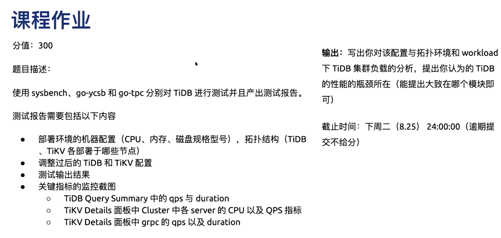
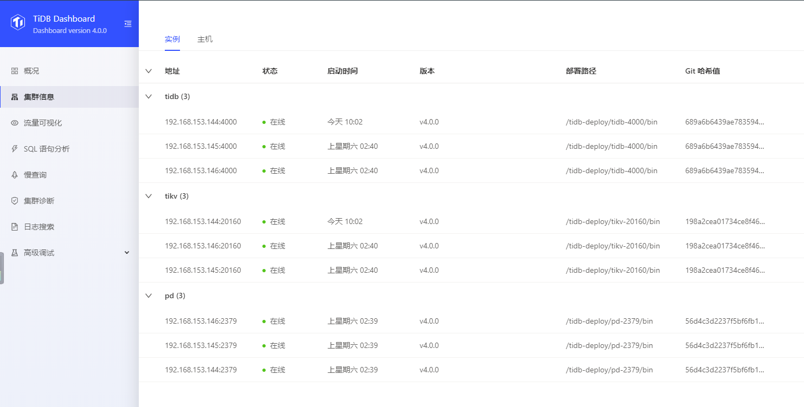

# homework2



## 集群规划

| Server       | IP              | 配置 | 实例                              |
| ------------ | --------------- | ---- | ---------------------------------|
| nod1(master) | 192.168.153.144 | 4C3G | PD, TiDB, TiKV                   |
| node2        | 192.168.153.145 | 4C2G | PD, TiDB, TiKV                   |
| node3        | 192.168.153.146 | 4C2G | PD, TiDB, TiKV                   |
| node4        | 192.168.153.147 | 4C2G | monitoring, grafana, alertmanager|

## Tiup部署TiDB测试集群

1. 安装tiup工具

    ```jsx
    # 安装tiup
    curl --proto '=https' --tlsv1.2 -sSf https://tiup-mirrors.pingcap.com/install.sh | sh
    source $HOME/.bash_profile
    # 安装 TiUP cluster 组件
    tiup cluster
    # 或者更新 TiUP cluster 组件至最新版本：
    tiup update --self && tiup update cluster
    # 查看cluster组件版本
    tiup --binary cluster
    ```

2. 生成ssh key

    ```jsx
    ssh-keygen -t rsa
    ```

3. 编辑初始化配置文件

    ```jsx
    # simple-mini.yaml
    # # Global variables are applied to all deployments and used as the default value of
    # # the deployments if a specific deployment value is missing.
    global:
      user: "tidb"
      ssh_port: 22
      deploy_dir: "/tidb-deploy"
      data_dir: "/tidb-data"

    pd_servers:
      - host: 192.168.153.144
      - host: 192.168.153.145
      - host: 192.168.153.146

    tidb_servers:
      - host: 192.168.153.144
      - host: 192.168.153.145
      - host: 192.168.153.146

    tikv_servers:
      - host: 192.168.153.144
      - host: 192.168.153.145
      - host: 192.168.153.146

    monitoring_servers:
      - host: 192.168.153.147

    grafana_servers:
      - host: 192.168.153.147

    alertmanager_servers:
      - host: 192.168.153.147
    ```

4. 执行部署命令

    ```jsx
    tiup cluster deploy tidb-test v4.0.0 ./simple-mini.yaml --user root [-p] [-i /root/.ssh/id_rsa.pub]
    ```

5. 查看 TiUP 管理的集群情况

    ```jsx
    # tiup cluster list

    Starting component `cluster`: /root/.tiup/components/cluster/v1.0.9/tiup-cluster list
    Name       User  Version  Path                                            PrivateKey
    ----       ----  -------  ----                                            ----------
    tidb-test  tidb  v4.0.0   /root/.tiup/storage/cluster/clusters/tidb-test  /root/.tiup/storage/cluster/clusters/tidb-test/ssh/id_rsa
    ```

6. 检查部署的 TiDB 集群情况

    ```jsx
    # tiup cluster display tidb-test

    Starting component `cluster`: /root/.tiup/components/cluster/v1.0.9/tiup-cluster display tidb-test
    tidb Cluster: tidb-test
    tidb Version: v4.0.0
    ID                     Role          Host             Ports        OS/Arch       Status    Data Dir                      Deploy Dir
    --                     ----          ----             -----        -------       ------    --------                      ----------
    192.168.153.147:9093   alertmanager  192.168.153.147  9093/9094    linux/x86_64  inactive  /tidb-data/alertmanager-9093  /tidb-deploy/alertmanager-9093
    192.168.153.147:3000   grafana       192.168.153.147  3000         linux/x86_64  inactive  -                             /tidb-deploy/grafana-3000
    192.168.153.144:2379   pd            192.168.153.144  2379/2380    linux/x86_64  Down      /tidb-data/pd-2379            /tidb-deploy/pd-2379
    192.168.153.145:2379   pd            192.168.153.145  2379/2380    linux/x86_64  Down      /tidb-data/pd-2379            /tidb-deploy/pd-2379
    192.168.153.146:2379   pd            192.168.153.146  2379/2380    linux/x86_64  Down      /tidb-data/pd-2379            /tidb-deploy/pd-2379
    192.168.153.147:9090   prometheus    192.168.153.147  9090         linux/x86_64  inactive  /tidb-data/prometheus-9090    /tidb-deploy/prometheus-9090
    192.168.153.144:4000   tidb          192.168.153.144  4000/10080   linux/x86_64  Down      -                             /tidb-deploy/tidb-4000
    192.168.153.145:4000   tidb          192.168.153.145  4000/10080   linux/x86_64  Down      -                             /tidb-deploy/tidb-4000
    192.168.153.146:4000   tidb          192.168.153.146  4000/10080   linux/x86_64  Down      -                             /tidb-deploy/tidb-4000
    192.168.153.144:20160  tikv          192.168.153.144  20160/20180  linux/x86_64  Down      /tidb-data/tikv-20160         /tidb-deploy/tikv-20160
    192.168.153.145:20160  tikv          192.168.153.145  20160/20180  linux/x86_64  Down      /tidb-data/tikv-20160         /tidb-deploy/tikv-20160
    192.168.153.146:20160  tikv          192.168.153.146  20160/20180  linux/x86_64  Down      /tidb-data/tikv-20160         /tidb-deploy/tikv-20160
    ```

7. 启动集群

    ```jsx
    # tiup cluster start tidb-test
    Starting component `cluster`: /root/.tiup/components/cluster/v1.0.9/tiup-cluster start tidb-test
    Starting cluster tidb-test...
    + [ Serial ] - SSHKeySet: privateKey=/root/.tiup/storage/cluster/clusters/tidb-test/ssh/id_rsa, publicKey=/root/.tiup/storage/cluster/clusters/tidb-test/ssh/id_rsa.pub
    + [Parallel] - UserSSH: user=tidb, host=192.168.153.147
    + [Parallel] - UserSSH: user=tidb, host=192.168.153.146
    + [Parallel] - UserSSH: user=tidb, host=192.168.153.144
    + [Parallel] - UserSSH: user=tidb, host=192.168.153.144
    + [Parallel] - UserSSH: user=tidb, host=192.168.153.145
    + [Parallel] - UserSSH: user=tidb, host=192.168.153.144
    + [Parallel] - UserSSH: user=tidb, host=192.168.153.145
    + [Parallel] - UserSSH: user=tidb, host=192.168.153.146
    + [Parallel] - UserSSH: user=tidb, host=192.168.153.146
    + [Parallel] - UserSSH: user=tidb, host=192.168.153.147
    + [Parallel] - UserSSH: user=tidb, host=192.168.153.147
    + [Parallel] - UserSSH: user=tidb, host=192.168.153.145
    + [ Serial ] - StartCluster
    Starting component pd
            Starting instance pd 192.168.153.146:2379
            Starting instance pd 192.168.153.144:2379
            Starting instance pd 192.168.153.145:2379
            Start pd 192.168.153.145:2379 success
            Start pd 192.168.153.146:2379 success
            Start pd 192.168.153.144:2379 success
    Starting component node_exporter
            Starting instance 192.168.153.144
            Start 192.168.153.144 success
    Starting component blackbox_exporter
            Starting instance 192.168.153.144
            Start 192.168.153.144 success
    Starting component node_exporter
            Starting instance 192.168.153.145
            Start 192.168.153.145 success
    Starting component blackbox_exporter
            Starting instance 192.168.153.145
            Start 192.168.153.145 success
    Starting component node_exporter
            Starting instance 192.168.153.146
            Start 192.168.153.146 success
    Starting component blackbox_exporter
            Starting instance 192.168.153.146
            Start 192.168.153.146 success
    Starting component tikv
            Starting instance tikv 192.168.153.146:20160
            Starting instance tikv 192.168.153.144:20160
            Starting instance tikv 192.168.153.145:20160
            Start tikv 192.168.153.144:20160 success
            Start tikv 192.168.153.145:20160 success
            Start tikv 192.168.153.146:20160 success
    Starting component tidb
            Starting instance tidb 192.168.153.146:4000
            Starting instance tidb 192.168.153.144:4000
            Starting instance tidb 192.168.153.145:4000
            Start tidb 192.168.153.144:4000 success
            Start tidb 192.168.153.145:4000 success
            Start tidb 192.168.153.146:4000 success
    Starting component prometheus
            Starting instance prometheus 192.168.153.147:9090
            Start prometheus 192.168.153.147:9090 success
    Starting component node_exporter
            Starting instance 192.168.153.147
            Start 192.168.153.147 success
    Starting component blackbox_exporter
            Starting instance 192.168.153.147
            Start 192.168.153.147 success
    Starting component grafana
            Starting instance grafana 192.168.153.147:3000
            Start grafana 192.168.153.147:3000 success
    Starting component alertmanager
            Starting instance alertmanager 192.168.153.147:9093
            Start alertmanager 192.168.153.147:9093 success
    + [ Serial ] - UpdateTopology: cluster=tidb-test
    Started cluster `tidb-test` successfully
    ```

8. 验证集群运行状态

    ```jsx
    # tiup cluster display tidb-test
    Starting component `cluster`: /root/.tiup/components/cluster/v1.0.9/tiup-cluster display tidb-test
    tidb Cluster: tidb-test
    tidb Version: v4.0.0
    ID                     Role          Host             Ports        OS/Arch       Status  Data Dir                      Deploy Dir
    --                     ----          ----             -----        -------       ------  --------                      ----------
    192.168.153.147:9093   alertmanager  192.168.153.147  9093/9094    linux/x86_64  Up      /tidb-data/alertmanager-9093  /tidb-deploy/alertmanager-9093
    192.168.153.147:3000   grafana       192.168.153.147  3000         linux/x86_64  Up      -                             /tidb-deploy/grafana-3000
    192.168.153.144:2379   pd            192.168.153.144  2379/2380    linux/x86_64  Up      /tidb-data/pd-2379            /tidb-deploy/pd-2379
    192.168.153.145:2379   pd            192.168.153.145  2379/2380    linux/x86_64  Up|L    /tidb-data/pd-2379            /tidb-deploy/pd-2379
    192.168.153.146:2379   pd            192.168.153.146  2379/2380    linux/x86_64  Up|UI   /tidb-data/pd-2379            /tidb-deploy/pd-2379
    192.168.153.147:9090   prometheus    192.168.153.147  9090         linux/x86_64  Up      /tidb-data/prometheus-9090    /tidb-deploy/prometheus-9090
    192.168.153.144:4000   tidb          192.168.153.144  4000/10080   linux/x86_64  Up      -                             /tidb-deploy/tidb-4000
    192.168.153.145:4000   tidb          192.168.153.145  4000/10080   linux/x86_64  Up      -                             /tidb-deploy/tidb-4000
    192.168.153.146:4000   tidb          192.168.153.146  4000/10080   linux/x86_64  Up      -                             /tidb-deploy/tidb-4000
    192.168.153.144:20160  tikv          192.168.153.144  20160/20180  linux/x86_64  Up      /tidb-data/tikv-20160         /tidb-deploy/tikv-20160
    192.168.153.145:20160  tikv          192.168.153.145  20160/20180  linux/x86_64  Up      /tidb-data/tikv-20160         /tidb-deploy/tikv-20160
    192.168.153.146:20160  tikv          192.168.153.146  20160/20180  linux/x86_64  Up      /tidb-data/tikv-20160         /tidb-deploy/tikv-20160
    ```

    或者通过MySQL 客户端连接验证。

    ```jsx
    mysql -u root -h 192.168.153.144 -P 4000
    ```

    

    ### 启用 TiDB Dashboard

    ```jsx
    tiup ctl pd -u http://192.168.153.145:2379 config set dashboard-address auto
    tiup cluster display tidb-test --dashboard
    ```
    
    

## 集群性能测试

### 使用 Sysbench 测试 TiDB

Scriptable database and system performance benchmark

github: [https://github.com/akopytov/sysbench](https://github.com/akopytov/sysbench)

```jsx
# Centos
curl -s https://packagecloud.io/install/repositories/akopytov/sysbench/script.rpm.sh | sudo bash
sudo yum -y install sysbench

# sysbench  --version
sysbench 1.0.20
```

1. sysbench配置文件参考示例如下

```jsx
#config
mysql-host=192.168.153.144
mysql-port=4000
mysql-user=root
mysql-password=
mysql-db=sbtest
time=600
threads=16
report-interval=10
db-driver=mysql
```

2. 执行SQL

```jsx
-- TiDB 使用乐观事务模型，当发现并发冲突时，会回滚事务。将 tidb_disable_txn_auto_retry 设置为 off 会开启事务冲突后的自动重试机制，
-- 可以尽可能避免事务冲突报错导致 Sysbench 程序退出的问题
set global tidb_disable_txn_auto_retry = off;
set global tidb_txn_mode = "optimistic";

create database sbtest;
```

3. 导入数据

```jsx
sysbench --config-file=config oltp_point_select --threads=8 --tables=16 --table-size=10000 prepare
```

4. 执行测试

- ~~Point select 测试命令~~

```
sysbench --config-file=config oltp_point_select --threads=16 --tables=8 --table-size=10000 run
```

- Update index 测试命令

```
# sysbench --config-file=config oltp_update_index --threads=16 --tables=8 --table-size=10000 run

SQL statistics:
    queries performed:
        read:                            0
        write:                           351280
        other:                           0
        total:                           351280
    transactions:                        351280 (585.44 per sec.)
    queries:                             351280 (585.44 per sec.)
    ignored errors:                      0      (0.00 per sec.)
    reconnects:                          0      (0.00 per sec.)

General statistics:
    total time:                          600.0255s
    total number of events:              351280

Latency (ms):
         min:                                   12.31
         avg:                                   27.33
         max:                                  463.00
         95th percentile:                       37.56
         sum:                              9598742.13

Threads fairness:
    events (avg/stddev):           21955.0000/54.40
    execution time (avg/stddev):   599.9214/0.01
```

- Read-only 测试命令

```
# sysbench --config-file=config oltp_read_only --threads=16 --tables=8 --table-size=10000 run

SQL statistics:
    queries performed:
        read:                            2145710
        write:                           0
        other:                           306530
        total:                           2452240
    transactions:                        153265 (255.42 per sec.)
    queries:                             2452240 (4086.74 per sec.)
    ignored errors:                      0      (0.00 per sec.)
    reconnects:                          0      (0.00 per sec.)

General statistics:
    total time:                          600.0462s
    total number of events:              153265

Latency (ms):
         min:                                   29.55
         avg:                                   62.63
         max:                                  170.61
         95th percentile:                       82.96
         sum:                              9599533.98

Threads fairness:
    events (avg/stddev):           9579.0625/10.18
    execution time (avg/stddev):   599.9709/0.01

# sysbench --config-file=config oltp_read_only --threads=6 --tables=8 --table-size=10000 run

SQL statistics:
    queries performed:
        read:                            1346660
        write:                           0
        other:                           192380
        total:                           1539040
    transactions:                        96190  (160.31 per sec.)
    queries:                             1539040 (2564.95 per sec.)
    ignored errors:                      0      (0.00 per sec.)
    reconnects:                          0      (0.00 per sec.)

General statistics:
    total time:                          600.0269s
    total number of events:              96190

Latency (ms):
         min:                                   17.70
         avg:                                   37.42
         max:                                  187.88
         95th percentile:                       51.02
         sum:                              3599592.51

Threads fairness:
    events (avg/stddev):           16031.6667/11.51
    execution time (avg/stddev):   599.9321/0.01

#threads为16的时候，宿主机的CPU一直在100%
#threads为 6的时候，宿主机的CPU基本在70%左右，后面修改TiDB优化数据的时候，将threads设定为6。
```

- Write-only 测试命令

```
# sysbench --config-file=config oltp_write_only --threads=16 --tables=8 --table-size=10000 run

SQL statistics:
    queries performed:
        read:                            0
        write:                           544948
        other:                           272474
        total:                           817422
    transactions:                        136237 (227.01 per sec.)
    queries:                             817422 (1362.08 per sec.)
    ignored errors:                      0      (0.00 per sec.)
    reconnects:                          0      (0.00 per sec.)

General statistics:
    total time:                          600.1256s
    total number of events:              136237

Latency (ms):
         min:                                   13.38
         avg:                                   70.46
         max:                                 6782.37
         95th percentile:                      130.13
         sum:                              9599531.73

Threads fairness:
    events (avg/stddev):           8514.8125/83.37
    execution time (avg/stddev):   599.9707/0.03
```

- Read-Write 测试命令

```
# sysbench --config-file=config oltp_read_write --threads=16 --tables=8 --table-size=10000 run

SQL statistics:
    queries performed:
        read:                            840154
        write:                           240044
        other:                           120022
        total:                           1200220
    transactions:                        60011  (100.00 per sec.)
    queries:                             1200220 (1999.92 per sec.)
    ignored errors:                      0      (0.00 per sec.)
    reconnects:                          0      (0.00 per sec.)

General statistics:
    total time:                          600.1306s
    total number of events:              60011

Latency (ms):
         min:                                   33.97
         avg:                                  159.98
         max:                                 3373.23
         95th percentile:                      231.53
         sum:                              9600707.20

Threads fairness:
    events (avg/stddev):           3750.6875/18.92
    execution time (avg/stddev):   600.0442/0.04
```

### 性能监控

1. TiDB Query Summary 中的 qps 与 duration


2. TiKV Details 面板中 Cluster 中各 server 的 CPU 以及 QPS 指标


3. TiKV Details 面板中 grpc 的 qps 以及 duration


### 使用 go-ycsb 测试TiDB

A Go port of Yahoo! Cloud Serving Benchmark (YCSB)

github: [https://github.com/pingcap/go-ycsb](https://github.com/pingcap/go-ycsb)

由于go-ycsb是语言编写的，所有需要安装go环境 `yum install golang`。

```jsx
git clone https://github.com/pingcap/go-ycsb.git $GOPATH/src/github.com/pingcap/go-ycsb
cd $GOPATH/src/github.com/pingcap/go-ycsb
make

./bin/go-ycsb
# 编译的时候，需要用到代理，否则网络访问有问题
[root@kmaster1 go-ycsb]# ./bin/go-ycsb
Go YCSB

Usage:
  go-ycsb [command]

Available Commands:
  help        Help about any command
  load        YCSB load benchmark
  run         YCSB run benchmark
  shell       YCSB Command Line Client

Flags:
  -h, --help   help for go-ycsb

Use "go-ycsb [command] --help" for more information about a command.
```

#### load & run

```jsx
[root@kmaster1 go-ycsb]# ./bin/go-ycsb load mysql -P workloads/workloada -p recordcound=10000 -p mysql.host=192.168.153.144 -p mysql.port=4000 --threads 8
***************** properties *****************
"readproportion"="0.5"
"recordcount"="1000"
"recordcound"="10000"
"updateproportion"="0.5"
"readallfields"="true"
"mysql.port"="4000"
"threadcount"="8"
"operationcount"="1000"
"requestdistribution"="uniform"
"scanproportion"="0"
"mysql.host"="192.168.153.144"
"insertproportion"="0"
"workload"="core"
"dotransactions"="false"
**********************************************
Run finished, takes 2.892731056s
INSERT - Takes(s): 2.8, Count: 1000, OPS: 355.6, Avg(us): 16808, Min(us): 11096, Max(us): 82597, 99th(us): 25000, 99.9th(us): 83000, 99.99th(us): 83000
[root@kmaster1 go-ycsb]# ./bin/go-ycsb run mysql -P workloads/workloada -p recordcound=10000 -p mysql.host=192.168.153.144 -p mysql.port=4000 --threads 8
***************** properties *****************
"mysql.port"="4000"
"scanproportion"="0"
"updateproportion"="0.5"
"workload"="core"
"recordcount"="1000"
"insertproportion"="0"
"readallfields"="true"
"recordcound"="10000"
"threadcount"="8"
"readproportion"="0.5"
"requestdistribution"="uniform"
"operationcount"="1000"
"dotransactions"="true"
"mysql.host"="192.168.153.144"
**********************************************
Run finished, takes 1.561818873s
READ   - Takes(s): 1.5, Count: 502, OPS: 325.6, Avg(us): 5495, Min(us): 2692, Max(us): 20188, 99th(us): 11000, 99.9th(us): 21000, 99.99th(us): 21000
UPDATE - Takes(s): 1.5, Count: 498, OPS: 322.2, Avg(us): 17892, Min(us): 8560, Max(us): 31551, 99th(us): 28000, 99.9th(us): 32000, 99.99th(us): 32000
```

### 使用 go-tpc 测试TiDB

A toolbox to benchmark TPC workloads in Go

github: [https://github.com/pingcap/go-tpc](https://github.com/pingcap/go-tpc)

```jsx
# curl --proto '=https' --tlsv1.2 -sSf https://raw.githubusercontent.com/pingcap/go-tpc/master/install.sh | sh
# source /root/.bash_profile
# go-tpc
Benchmark database with different workloads

Usage:
  go-tpc [command]

Available Commands:
  help        Help about any command
  tpcc
  tpch

Flags:
      --count int           Total execution count, 0 means infinite
  -D, --db string           Database name (default "test")
  -d, --driver string       Database driver: mysql
      --dropdata            Cleanup data before prepare
  -h, --help                help for go-tpc
  -H, --host string         Database host (default "127.0.0.1")
      --ignore-error        Ignore error when running workload
      --interval duration   Output interval time (default 10s)
      --isolation int       Isolation Level 0: Default, 1: ReadUncommitted,
                            2: ReadCommitted, 3: WriteCommitted, 4: RepeatableRead,
                            5: Snapshot, 6: Serializable, 7: Linerizable
  -p, --password string     Database password
  -P, --port int            Database port (default 4000)
      --pprof string        Address of pprof endpoint
      --silence             Don't print error when running workload
  -T, --threads int         Thread concurrency (default 16)
      --time duration       Total execution time (default 2562047h47m16.854775807s)
  -U, --user string         Database user (default "root")

Use "go-tpc [command] --help" for more information about a command.
```

Prepare & run

```jsx
# go-tpc tpcc -H 192.168.153.144 -P 4000 -D tpcc --warehouses 2 --threads 8 prepare
creating table warehouse
creating table district
creating table customer
creating table history
creating table new_order
creating table orders
creating table order_line
creating table stock
creating table item
load to item
load to customer in warehouse 1 district 10
load to customer in warehouse 2 district 6
load to customer in warehouse 1 district 7
load to customer in warehouse 1 district 5
......
begin to check warehouse 1 at condition 3.3.2.11
begin to check warehouse 1 at condition 3.3.2.1
begin to check warehouse 1 at condition 3.3.2.2
begin to check warehouse 1 at condition 3.3.2.6
begin to check warehouse 2 at condition 3.3.2.5
begin to check warehouse 2 at condition 3.3.2.8
begin to check warehouse 2 at condition 3.3.2.9
begin to check warehouse 2 at condition 3.3.2.2
begin to check warehouse 2 at condition 3.3.2.3
Finished

# go-tpc tpcc -H 192.168.153.144 -P 4000 -D tpcc --warehouses 2 --threads 8 --time 1m run
DELIVERY - Takes(s): 49.6, Count: 37, TPM: 44.7, Sum(ms): 5833, Avg(ms): 157, 95th(ms): 512, 99th(ms): 2000, 99.9th(ms): 2000
NEW_ORDER - Takes(s): 49.7, Count: 462, TPM: 557.6, Sum(ms): 21461, Avg(ms): 46, 95th(ms): 96, 99th(ms): 256, 99.9th(ms): 2000
NEW_ORDER_ERR - Takes(s): 49.7, Count: 2, TPM: 2.4, Sum(ms): 532, Avg(ms): 266, 95th(ms): 512, 99th(ms): 512, 99.9th(ms): 512
ORDER_STATUS - Takes(s): 48.9, Count: 37, TPM: 45.4, Sum(ms): 1349, Avg(ms): 36, 95th(ms): 112, 99th(ms): 160, 99.9th(ms): 160
PAYMENT - Takes(s): 49.9, Count: 481, TPM: 578.8, Sum(ms): 16104, Avg(ms): 33, 95th(ms): 64, 99th(ms): 512, 99.9th(ms): 1000
PAYMENT_ERR - Takes(s): 49.8, Count: 5, TPM: 6.0, Sum(ms): 836, Avg(ms): 167, 95th(ms): 512, 99th(ms): 512, 99.9th(ms): 512
STOCK_LEVEL - Takes(s): 48.2, Count: 35, TPM: 43.6, Sum(ms): 895, Avg(ms): 25, 95th(ms): 80, 99th(ms): 96, 99.9th(ms): 96
Finished
DELIVERY - Takes(s): 63.6, Count: 37, TPM: 34.9, Sum(ms): 5833, Avg(ms): 157, 95th(ms): 512, 99th(ms): 2000, 99.9th(ms): 2000
NEW_ORDER - Takes(s): 63.6, Count: 463, TPM: 436.5, Sum(ms): 40347, Avg(ms): 87, 95th(ms): 96, 99th(ms): 512, 99.9th(ms): 16000
NEW_ORDER_ERR - Takes(s): 63.7, Count: 2, TPM: 1.9, Sum(ms): 532, Avg(ms): 266, 95th(ms): 512, 99th(ms): 512, 99.9th(ms): 512
ORDER_STATUS - Takes(s): 62.9, Count: 37, TPM: 35.3, Sum(ms): 1349, Avg(ms): 36, 95th(ms): 112, 99th(ms): 160, 99.9th(ms): 160
PAYMENT - Takes(s): 63.8, Count: 481, TPM: 452.4, Sum(ms): 16104, Avg(ms): 33, 95th(ms): 64, 99th(ms): 512, 99.9th(ms): 1000
PAYMENT_ERR - Takes(s): 63.7, Count: 5, TPM: 4.7, Sum(ms): 836, Avg(ms): 167, 95th(ms): 512, 99th(ms): 512, 99.9th(ms): 512
STOCK_LEVEL - Takes(s): 62.2, Count: 35, TPM: 33.8, Sum(ms): 895, Avg(ms): 25, 95th(ms): 80, 99th(ms): 96, 99.9th(ms): 96
（这个地方没有打出视频中类似的tpmC的值?）
------------------------------------------------------------------
(通过github编译了一个版本，出现了tpmC的值，应该是通过sh安装的版本比较低的缘故。)

# ./bin/go-tpc tpcc -H 192.168.153.144 -P 4000 -D tpcc --warehouses 2 --threads 8 --time 1m run
[Current] ORDER_STATUS - Takes(s): 9.6, Count: 10, TPM: 62.2, Sum(ms): 235, Avg(ms): 23, 90th(ms): 40, 99th(ms): 48, 99.9th(ms): 48
[Current] PAYMENT - Takes(s): 10.0, Count: 130, TPM: 780.6, Sum(ms): 3189, Avg(ms): 24, 90th(ms): 32, 99th(ms): 48, 99.9th(ms): 64
[Current] STOCK_LEVEL - Takes(s): 8.0, Count: 8, TPM: 60.3, Sum(ms): 270, Avg(ms): 33, 90th(ms): 64, 99th(ms): 64, 99.9th(ms): 64
Finished
[Summary] DELIVERY - Takes(s): 59.7, Count: 85, TPM: 85.4, Sum(ms): 6967, Avg(ms): 81, 90th(ms): 112, 99th(ms): 256, 99.9th(ms): 256
[Summary] DELIVERY_ERR - Takes(s): 59.7, Count: 1, TPM: 1.0, Sum(ms): 79, Avg(ms): 79, 90th(ms): 80, 99th(ms): 80, 99.9th(ms): 80
[Summary] NEW_ORDER - Takes(s): 59.8, Count: 957, TPM: 960.2, Sum(ms): 30697, Avg(ms): 32, 90th(ms): 48, 99th(ms): 80, 99.9th(ms): 256
[Summary] NEW_ORDER_ERR - Takes(s): 59.8, Count: 5, TPM: 5.0, Sum(ms): 560, Avg(ms): 112, 90th(ms): 512, 99th(ms): 512, 99.9th(ms): 512
[Summary] ORDER_STATUS - Takes(s): 59.6, Count: 84, TPM: 84.6, Sum(ms): 1393, Avg(ms): 16, 90th(ms): 32, 99th(ms): 48, 99.9th(ms): 48
[Summary] PAYMENT - Takes(s): 59.9, Count: 898, TPM: 900.0, Sum(ms): 19591, Avg(ms): 21, 90th(ms): 32, 99th(ms): 48, 99.9th(ms): 64
[Summary] PAYMENT_ERR - Takes(s): 59.9, Count: 2, TPM: 2.0, Sum(ms): 95, Avg(ms): 47, 90th(ms): 64, 99th(ms): 64, 99.9th(ms): 64
[Summary] STOCK_LEVEL - Takes(s): 59.9, Count: 69, TPM: 69.1, Sum(ms): 1657, Avg(ms): 24, 90th(ms): 40, 99th(ms): 64, 99.9th(ms): 64
tpmC: 960.2 (每分钟成交的new order订单数量)
```

#### TPCH

```jsx
# ./bin/go-tpc tpch prepare -H 192.168.153.144 -P 4000 -D tpch --sf 1 --analyze
creating nation
creating region
creating part
creating supplier
creating partsupp
creating customer
creating orders
creating lineitem
generating nation table
generate nation table done
generating region table
generate region table done
generating customers table
generate customers table done
generating suppliers table
generate suppliers table done
generating part/partsupplier tables
generate part/partsupplier tables done
generating orders/lineitem tables
generate orders/lineitem tables done
analyzing table lineitem
analyze table lineitem done
analyzing table partsupp
analyze table partsupp done
analyzing table supplier
analyze table supplier done
analyzing table part
analyze table part done
analyzing table orders
analyze table orders done
analyzing table customer
analyze table customer done
analyzing table region
analyze table region done
analyzing table nation
analyze table nation done
Finished

# ./bin/go-tpc tpch run -H 192.168.153.144 -P 4000 -D tpch --sf 1
[Current] Q1: 2.42s
[Current] Q2: 36.44s
[Current] Q3: 91.14s
[2020-08-21 21:51:53] execute run failed, err execute query
select
        o_orderpriority,
        count(*) as order_count
from
        orders
where
        o_orderdate >= '1995-01-01'
        and o_orderdate < date_add('1995-01-01', interval '3' month)
        and exists (
                select
                        *
                from
                        lineitem
                where
                        l_orderkey = o_orderkey
                        and l_commitdate < l_receiptdate
        )
group by
        o_orderpriority
order by
        o_orderpriority;
 failed Error 9001: PD server timeout%!(EXTRA string=start timestamp may fall behind safe point)
execute run failed, err execute query
select
        o_orderpriority,
        count(*) as order_count
from
        orders
where
        o_orderdate >= '1995-01-01'
        and o_orderdate < date_add('1995-01-01', interval '3' month)
        and exists (
                select
                        *
                from
                        lineitem
                where
                        l_orderkey = o_orderkey
                        and l_commitdate < l_receiptdate
        )
group by
        o_orderpriority
order by
        o_orderpriority;
 failed Error 9001: PD server timeout%!(EXTRA string=start timestamp may fall behind safe point)
Finished
[Summary] Q1: 2.42s
[Summary] Q2: 36.44s
[Summary] Q3: 91.14s
```

> 由于采用了虚拟机，所以只能去模拟很小的数据量，也无法真实体现TiDB的性能，仅仅是起到练习工具使用的目的。

## 集群性能优化

经过上面步骤使用 sysbench、go-ycsb 和 go-tpc 分别对TiDB 进行测试，基本上了解了这几个性能测试工具的使用，下面主要测试一些集群配置项来熟悉TiDB的配置已经配置项对性能的影响。由于采用的是虚拟机，所以仍然是以练习为主。

思路是：

1. 创建一个全新的测试用TiDB集群（集群拓扑结构通上tidb-test）
2. 选定一个测试方式，这里采用to-tpc
3. 使用TiDB默认是获取一个性能基准数据
4. 一次改变一个配置项，然后通第3步的基准数据比较

所以综合下来，同时为了更快的获得反馈，这里采用tpcc作为验证的方式。

```jsx
use 'tiup cluster edit-config' and 'tiup cluster reload' to update the configuration
```

具体的配置项，可以查看 [在线修改集群配置](https://docs.pingcap.com/zh/tidb/stable/dynamic-config)

```jsx
修改全部 TiKV 实例配置：
set config tikv log.level="info"

修改单个 TiKV 实例配置：
set config "127.0.0.1:20180" log.level="info"
```
#### 测试配置项及性能数据
| Instance | Name                     | Value | Default Value | tmpC      |
| -------- | ------------------------ | ----- | ------------- | ----------|
| tikv     | log.level                | info  | info          | 1350.1    |
|          | log.level                | error | info          | 1441.7    |
|          | raftstore.messages-per-tick | 2048  | 4096       | 1357.2    |
|          | raftstore.sync-log       | FALSE | TRUE          | 1823.9    |
|          | {db_name}.max-background-jobs  | 6     | 3       | 1138.7    |
| pd       | schedule.region-schedule-limit | 1024  | 2048    | 1111.2    |
|          | schedule.region-schedule-limit | 4096  | 2048    | **120.7** |
| tidb     | tidb_slow_log_threshold        | 500   | 300     | 1369.4    |

在测试的过程中，尽管测试的数据量不大，发现磁盘IO长期保持100%，由于是虚拟机的方式，所以磁盘IO造成了TiKV成了整个集群的瓶颈。


另外，由于虚拟的CPU也比较弱，在练习PD部分的配置项的时候，比如实验`schedule.region-schedule-limit`的时候，发现`tmpC`的值特别低，查看集群的时候，发现部分PD节点挂掉了。造成一部分的配置项无法在虚拟机环境下顺利的进行实验。

# Troubleshooting

1. Centos7自带的git版本太低，在编译go-ycsb会出错"fatal: git fetch-pack: expected shallow list"，所以需要更新git的版本

```jsx
# cat >> /etc/yum.repos.d/wandisco-git.repo <<EOF
[wandisco-git]
name=Wandisco GIT Repository
baseurl=http://opensource.wandisco.com/centos/7/git/$basearch/
enabled=1
gpgcheck=1
gpgkey=http://opensource.wandisco.com/RPM-GPG-KEY-WANdisco
EOF
# rpm --import http://opensource.wandisco.com/RPM-GPG-KEY-WANdisco
# yum install git
# git version
git version 2.22.0
```