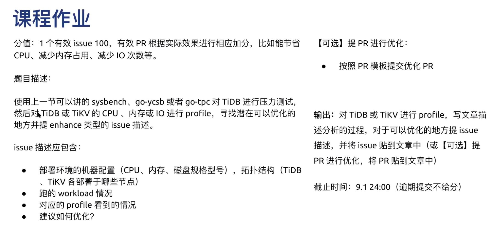

# homework3



# 使用go tool pprof

在 go 语言中，主要关注的应用运行情况主要包括以下几种：

- CPU profile：报告程序的 CPU 使用情况，按照一定频率去采集应用程序在 CPU 和寄存器上面的数据
- Memory Profile（Heap Profile）：报告程序的内存使用情况
- Block Profiling：报告 goroutines 不在运行状态的情况，可以用来分析和查找死锁等性能瓶颈
- Goroutine Profiling：报告 goroutines 的使用情况，有哪些 goroutine，它们的调用关系是怎样的

做 Profiling 第一步就是怎么获取应用程序的运行情况数据。pprof是一个可视化和分析剖析数据的工具。

pprof 可以读取profile.proto格式的剖析样本集合，并生成报告以可视化和帮助分析数据。它可以生成文本和图形报告（通过使用可视化包 graphviz）。

profile.proto是一个协议缓冲区，它描述了一组调用栈和符号化信息。一个常见的用法是表示一组来自统计剖析的采样callstack。其格式在proto/profile.proto文件上有描述。关于协议缓冲区的详细信息，请参见https://developers.google.com/protocol-buffers。

go 语言提供了 `runtime/pprof` 和 `net/http/pprof` 两个库，分别针对两种Profile的使用场景。

## 工具型应用

通过手动调用 `runtime.StartCPUProfile` 或者 `runtime.StopCPUProfile` 等 API来生成和写入采样文件。

```bash
cpu_file, err := os.Create("./cpu.pprof")
...
pprof.StartCPUProfile(cpu_file)
defer pprof.StopCPUProfile()

mem_file, error := os.Create("./mem.pprof")
...
pprof.WriteHeapProfile(mem_file)
defer mem_file.Close()
```

然后就可以使用 `go tool pprof` 工具来分析生成的采样文件。


主要命令:

- top N: 列出CPU使用最高的N个采样方法，比如 `top 5` 列出前5个耗时最多的函数。
- list Func: 显示函数名以及每行代码的采样分析。
- web: 生成 svg 热点图片，可在浏览器中打开，可使用 web Func 来过滤指定函数相关调用树。需要graphviz支持。

**指标说明:**

- flat: 采样时，该函数正在运行的次数*采样频率(10ms)，即得到估算的函数运行”采样时间”。这里不包括函数等待子函数返回。
- flat%: flat / 总采样时间值
- sum%: 前面所有行的 flat% 的累加值，如第二行 sum% = 20.82% = 11.12% + 9.70%
- cum: 采样时，该函数出现在调用堆栈的采样时间，包括函数等待子函数返回。因此 flat <= cum
- cum%: cum / 总采样时间值

## 服务型应用

通过 http 服务获取Profile采样文件，简单易用，适用于对应用程序的整体监控。

对于web 应用，可以使用 `net/http/pprof` 库，它能够在提供 HTTP 服务进行分析。

如果使用了默认的 `http.DefaultServeMux`（通常是代码直接使用 `http.ListenAndServe("0.0.0.0:8000", nil)`），只需要添加一行：

```
import _ "net/http/pprof"
```

如果使用了自定义的 `Mux`，则需要手动注册一些路由规则：

```
r.HandleFunc("/debug/pprof/", pprof.Index)
r.HandleFunc("/debug/pprof/cmdline", pprof.Cmdline)
r.HandleFunc("/debug/pprof/profile", pprof.Profile)
r.HandleFunc("/debug/pprof/symbol", pprof.Symbol)
r.HandleFunc("/debug/pprof/trace", pprof.Trace)
```

不管哪种方式，pprof都会暴露 `/debug/pprof` 这个endpoint，访问它会得到类似下面的内容：

```
/debug/pprof/

profiles:
0    block
62    goroutine
444    heap
30    threadcreate

full goroutine stack dump
```

这个路径下还有几个子页面：

- `/debug/pprof/profile`：访问这个链接会自动进行 CPU profiling，持续 30s，并生成一个文件供下载
- `/debug/pprof/heap`： Memory Profiling 的路径，访问这个链接会得到一个内存 Profiling 结果的文件
- `/debug/pprof/block`：block Profiling 的路径
- `/debug/pprof/goroutines`：运行的 goroutines 列表，以及调用关系

在使用 `go tool pprof` 的时候，可以直接指定上面的某个地址，就可以分析相应的profile，比如:

- 通过交互式命令行方式: `go tool pprof http://localhost:6060/debug/pprof/profile`
- 通过HTTP WEB方式: `pprof -http=localhost:8080 [http://localhost:6060/debug/pprof/profile](http://localhost:6060/debug/pprof/profile)` 会自动的启动浏览器并以可视化的形式展示。(需要安装 `graphviz` 软件包)，可以生成调用关系图，火焰图。


## **go test 工具集成**

go test 命令有两个参数和 pprof 相关，它们分别指定生成的 CPU 和 Memory profiling 保存的文件：

- `cpuprofile`：cpu profiling 数据要保存的文件地址
- `memprofile`：memory profiling 数据要报文的文件地址

比如下面执行测试的同时，也会执行 CPU profiling，并把结果保存在 `cpu.prof` 文件中：

```
$ go test -bench . -cpuprofile=cpu.prof
```

执行结束之后，就会生成 `main.test` 和 `cpu.prof` 文件。要想使用 `go tool pprof`，需要指定的二进制文件就是 `main.test`。

# **perf简介**

perf是一款linux内置的性能分析工具，随着内核发布，也被称为perf_events, perf tools, PCL(Performance Counters for Linux), 发布于Linux kernel version 2.6.31, perf是怎么工作的呢？perf如何使用？本文是来介绍一下。

perf[官方wiki](https://perf.wiki.kernel.org/index.php/Main_Page)的介绍是：Linux profiling with performance counters

Perf可以解决高级性能和故障排除，它可以分析：

- 为什么内核消耗CPU高, 代码的位置在哪里？
- 什么代码引起了CPU 2级cache未命中？
- CPU是否消耗在内存I/O上？
- 哪些代码分配内存，分配了多少？
- 什么触发了TCP重传？
- 某个内核函数是否正在被调用，调用频率多少？
- 线程释放CPU的原因？

## 安装

1. 通过包管理进行安装

    ```jsx
    # Centos
    yum install perf gawk

    # Ubuntu
    apt install linux-tools-common gawk

    # perf

     usage: perf [--version] [--help] [OPTIONS] COMMAND [ARGS]

     The most commonly used perf commands are:
       annotate        Read perf.data (created by perf record) and display annotated code
       archive         Create archive with object files with build-ids found in perf.data file
       bench           General framework for benchmark suites
       buildid-cache   Manage build-id cache.
       buildid-list    List the buildids in a perf.data file
       c2c             Shared Data C2C/HITM Analyzer.
       config          Get and set variables in a configuration file.
       data            Data file related processing
       diff            Read perf.data files and display the differential profile
       evlist          List the event names in a perf.data file
       ftrace          simple wrapper for kernel's ftrace functionality
       inject          Filter to augment the events stream with additional information
       kallsyms        Searches running kernel for symbols
       kmem            Tool to trace/measure kernel memory properties
       kvm             Tool to trace/measure kvm guest os
       list            List all symbolic event types
       lock            Analyze lock events
       mem             Profile memory accesses
       record          Run a command and record its profile into perf.data
       report          Read perf.data (created by perf record) and display the profile
       sched           Tool to trace/measure scheduler properties (latencies)
       script          Read perf.data (created by perf record) and display trace output
       stat            Run a command and gather performance counter statistics
       test            Runs sanity tests.
       timechart       Tool to visualize total system behavior during a workload
       top             System profiling tool.
       version         display the version of perf binary
       probe           Define new dynamic tracepoints
       trace           strace inspired tool

     See 'perf help COMMAND' for more information on a specific command.
    ```

2. 源码编译：找到对应内核版本的源码包，在tools/perf目录下进行编译

## perf command list

perf提供了一系列的命令来分析程序，如下：

| sub command   | 功能说明                                             |
| :------------ | :---------------------------------------------------|
| annotate      | 读取perf.data(由perf record生成)显示注释信息，如果被分析的进程含义debug符号信息，则会显示汇编和对应的源码，否则只显示汇编代码 |
| archive       | 根据perf.data(由perf record生成)文件中的build-id将相关的目标文件打包，方便在其他机器分析 |
| bench         | perf提供的基准套件的通用框架，可以对当前系统的调度，IPC，内存访问进行性能评估 |
| buildid-cache | 管理build-id,管理对于的bin文件                               |
| buildid-list  | 列出perf.data中的所以buildids                                |
| data          | 把perf.data文件转换成其他格式                                |
| diff          | 读取多个perf.data文件，并给出差异分析                        |
| evlist        | 列出perf.data中采集的事件列表                                |
| kmem          | 分析内核内存的使用                                           |
| kvm           | 分析kvm虚拟机上的guest os                                    |
| **list**      | **列出当前系统支持的所有事件名,可分为三类：硬件事件、软件事件，检查点** |
| lock          | 分析内核中的锁信息，包括锁的争用情况，等待延迟等             |
| **record**    | **对程序运行过程中的事件进行分析和记录，并写入perf.data**    |
| **report**    | **读取perf.data(由perf record生成) 并显示分析结果**          |
| sched         | 针对调度器子系统的分析工具。                                 |
| **script**    | **读取perf.data(由perf record生成)，生成trace记录，供其他分析工具使用** |
| **stat**      | **对程序运行过程中的性能计数器进行统计**                     |
| test          | perf对当前软硬件平台进行健全性测试，可用此工具测试当前的软硬件平台是否能支持perf的所有功能。 |
| timechart     | 对record结果进行可视化分析输出，record命令需要加上timechart记录 |
| top           | 对系统的性能进行分析，类型top命令，当然可以对单个进程进行分析 |
| probe         | 用于定义动态检查点。                                         |
| trace         | 类似于strace，跟踪目标的系统调用，但开销比strace小           |

perf的使用大体可以有三种方式：

- Counting：统计的方式，统计事件发生的次数，这种方式不生成perf.data文件，例如perf stat, perf top
- Sampling:   采样的方式，采样事件，并写入到内核buffer中，并异步写入perf.data文件中，perf.data文件可以被perf report或者perf script 命令读取。
- bpf programs on events([https://www.ibm.com/developerworks/cn/linux/l-lo-eBPF-history/index.html](https://www.ibm.com/developerworks/cn/linux/l-lo-eBPF-history/index.html))

# Tidb Inspect Tool

github: [https://github.com/pingcap/tidb-inspect-tools](https://github.com/pingcap/tidb-inspect-tools)

TiDB提供了一个很方便来Profile TiDB性能的工具包，可以借助该工具包来分析TiDB已经Server的性能。

比如可以通过下面的方式来分析TiKV的性能:

```jsx
# perf probe -x /tidb-deploy/tikv-20160/bin/tikv-server -a malloc
Added new event:
  probe_tikv:malloc    (on malloc in /tidb-deploy/tikv-20160/bin/tikv-server)

You can now use it in all perf tools, such as:

        perf record -e probe_tikv:malloc -aR sleep 1

# wget https://github.com/brendangregg/FlameGraph/archive/master.zip
# unzip master.zip
# sudo mv FlameGraph-master/ /opt/FlameGraph

# vi men.sh
#!/bin/bash

# Usage: sudo mem.sh pid
#
# Note:
#   This script can collect the malloc profile, if you link other memory allocator
#   like jemalloc, you may use `perf probe` to add the probe at first.
#   E.g., for TiKV, we use `sudo perf probe -x tikv_binary -a malloc`, and we also
#   need to use `perf record -e probe_tikv:malloc -F 99 -p $1 -g -- sleep 10` instead.

perf record -e probe_tikv:malloc -F 99 -p $1 -g -- sleep 10
# perf record -e malloc -F 99 -p $1 -g -- sleep 10
perf script > out.perf
/opt/FlameGraph/stackcollapse-perf.pl out.perf > out.folded
/opt/FlameGraph/flamegraph.pl  --colors=mem out.folded > mem.svg

# ps -ef | grep bin/tikv-server | grep -v grep | awk {'print $2'} | xargs sh mem.sh
[ perf record: Woken up 1 times to write data ]
[ perf record: Captured and wrote 0.159 MB perf.data (204 samples) ] 
```

执行完命令后，会生成相应的火焰图，以及相应的性能采样数据，然后使用 `perf report -i perf.data` 命令进行分析。(不过我这边通过 `perf report` 命令出来的数据比较少，可能是由于采样的时候系统是空闲的缘故)


# 参考列表

[性能分析利器之perf浅析](http://walkerdu.com/2018/09/13/perf-event/)

[Perf-用于Linux的性能监视和分析工具](https://www.howtoing.com/perf-performance-monitoring-and-analysis-tool-for-linux)